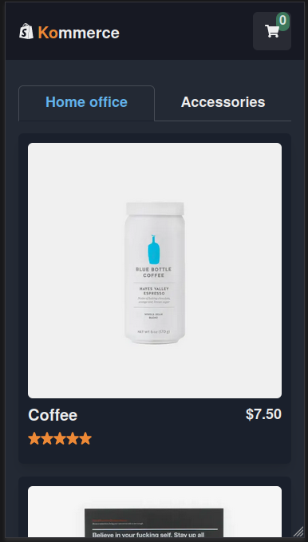
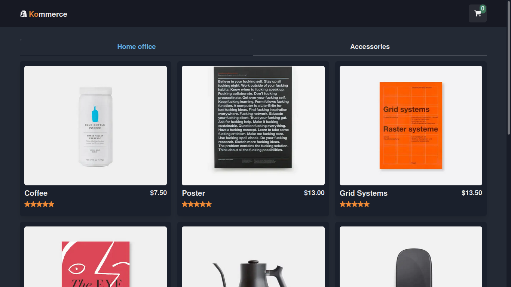

# 🛒 Kommerce (English / Português)
[](https://github.com/KlevertonOliveira/kommerce/blob/main/LICENSE)

---
## :link: Links
[Live Project Site](https://kommerce-klevertonoliveira.vercel.app/) /
[Site do Projeto ao vivo](https://kommerce-klevertonoliveira.vercel.app/)

---

## :art: Layout
### Mobile


---

### Desktop


---

## :movie_camera: Project Demonstration / Demonstração do Projeto

https://user-images.githubusercontent.com/71989630/158438547-6178cde5-9b08-4fc4-976b-ecac387e80c4.mp4

---

# English :uk:/:us:

## :mag_right: About the project

Kommerce is a project built with the intention of putting my skills into practice by developing an e-commerce virtual store application. For this purpose, the application uses the React ecosystem (with Next.js) and the CommerceJS and Stripe external APIs, in order to facilitate the development process.

More details about the project and the creation process can be found [here](MODIFICAR).

---

## :medal_military: Features
* Navigation and selection of products to compose shopping cart;
* Add products to cart (by quantity);
* Update products' quantities;
* Remove products;
* Clear cart;
* Registration of user information for shipping;
* Registration of payment information;
* Transaction completion status feedback;

----

## :gear: Technologies Used

### Front end
- HTML5
- [Next JS](https://nextjs.org/) (React Framework)
- [Chakra UI](https://chakra-ui.com/) (React Library for creating User Interfaces and Design Systems)
- [CommerceJS](https://commercejs.com/) (API focused on managing e-commerce services)
- [Stripe](https://stripe.com/br) (API focused on payments, transfers and management of online operations)

## :file_folder: How to run the project 

Prerequisites: npm / yarn

```bash
# Clone repository
git clone git@github.com:KlevertonOliveira/kommerce.git

# Enter the project folder
cd kommerce

# Install dependencies
yarn install 
or 
npm install

# Extra steps necessary to run the project:
## Create an account at the CommerceJS website in order to get a unique Api key (public and sandbox).
## Create an account at the Stripe website in order to get a unique Api key.
## Create a .env file and fill it following the model defined at .env.example using the Api keys obtained previously;
## At CommerceJS, it'll be necessary to register some products in order be able to use them inside the application.
 

# Run the project
yarn dev
or
npm run dev
```

## :raising_hand_man: Author

José Kleverton Yvens Oliveira

https://www.linkedin.com/in/kleverton-oliveira/

---
---
---

# Português :brazil:

## :mag_right: Sobre o projeto

Kommerce é um projeto construído com o intuito de colocar em prática minhas habilidades ao desenvolver uma aplicação de loja virtual de comércio eletrônico. A aplicação utiliza, para isso, o ecossistema React (Next.js) e as APIs externas CommerceJS e Stripe, em vista a facilitar o processo de desenvolvimento.

Mais detalhes sobre o projeto e o processo de criação podem ser encontrados [aqui](MODIFICAR).

---

## :medal_military: Features
* Navegação e seleção de produtos para composição do carrinho de compras;
* Adição de produtos por quantidades;
* Atualização de quantidades de produtos e gerenciamento do carrinho de compras;
* Remoção de produtos;
* Cadastro de informações do usuário para envio dos produtos;
* Cadastro de informações para realização do pagamento;
* Notificação/Feedback do status de conclusão da transação;

---

## :gear: Tecnologias utilizadas

### Front end
- HTML5
- [Next JS](https://nextjs.org/) (React Framework)
- [Chakra UI](https://chakra-ui.com/) (Biblioteca React para a criação de interfaces de usuário e Design Systems)
- [CommerceJS](https://commercejs.com/) (API com foco no gerenciamento de serviços de comércio eletrônico)
- [Stripe](https://stripe.com/br) (API centrada em pagamentos, repasses e gerenciamento de operações online)

---

Pré-requisitos: npm / yarn

```bash
# Clonar repositório
git clone git@github.com:KlevertonOliveira/kommerce.git

# Entrar na pasta do projeto
cd kommerce

# Instalar dependências
yarn install 
ou 
npm install

# Configurações extras necessárias para execução do projeto:
## Criar uma conta no website da CommerceJS para obter uma chave de API única (public e sandbox).
## Criar uma conta no website da Stripe para obter uma chave de API única.
## Criar um arquivo .env e preenchê-lo conforme o arquivo .env.example usando as chaves de API obtidas anteriormente;
## No site da CommerceJS, é necessário realizar o cadastro de alguns produtos para a utilização dos mesmos dentro da aplicação.

# Executar o projeto
yarn dev
ou
npm run dev
```

## :raising_hand_man: Autor

José Kleverton Yvens Oliveira

https://www.linkedin.com/in/kleverton-oliveira/


